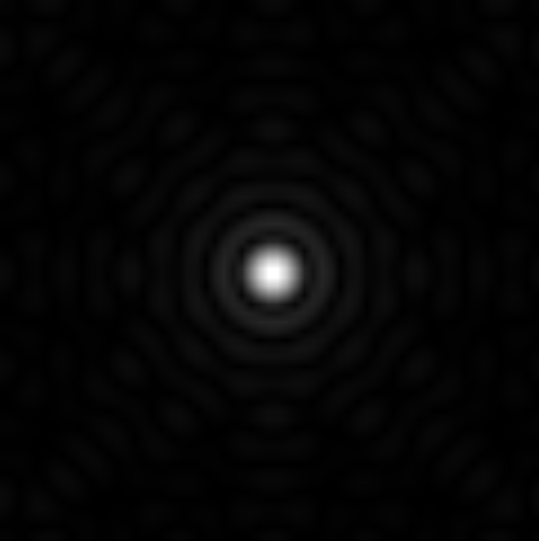

# Fraunhofer Diffraction: Fourier Analysis

In this project, we show that a worthwhile approach to understand the connection between Fraunhofer diffraction and Fourier transforms would be through **simulating far-field diffraction** by means of a computer program that computes **Fourier transforms**. This simple activity will allow students to utilise the known properties of Fourier transforms and simulate diffraction patterns of arbitrary apertures that are not easily available in laboratories.

### Some Results 

   

<em>Keyhole-shaped aperture and its diffraction pattern</em>

   

<em>Circular aperture and its diffraction pattern</em>

### To generate these results 
1. To generate the diffraction pattern for a keyhole/circular aperture run the this [code](/code/keyhole-aperture_patter.py). 

2. To generate the diffraction pattern for a rectangular aperture, run this [code](/code/rect-aperture_pattern.py). 

<em> Project completed under the supervision of Dr. Leena Joshi at St. Xavier's College, Mumbai <em>

